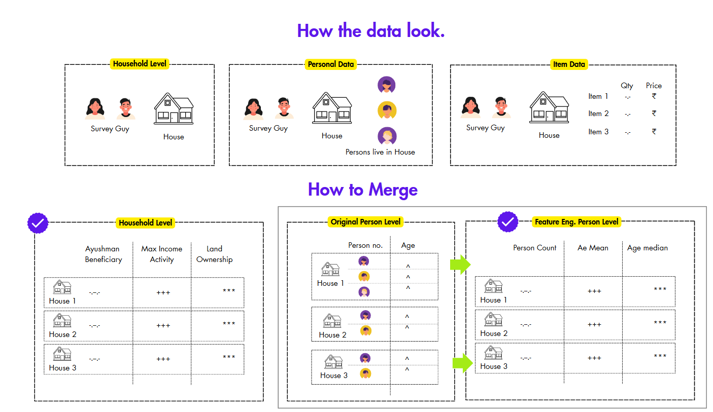
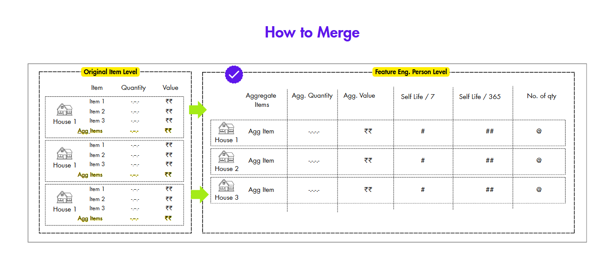
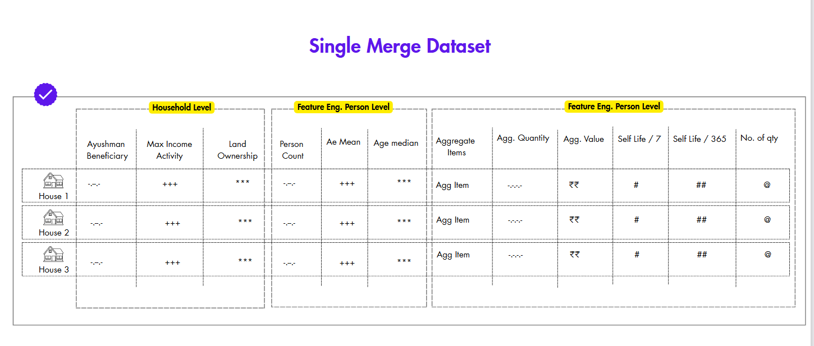
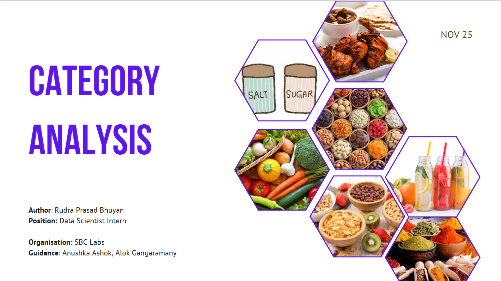
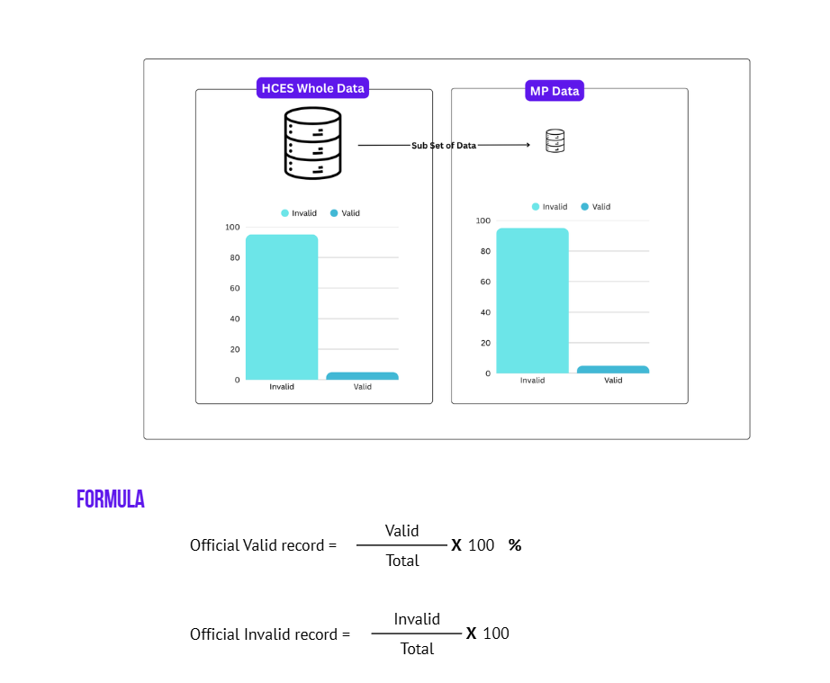
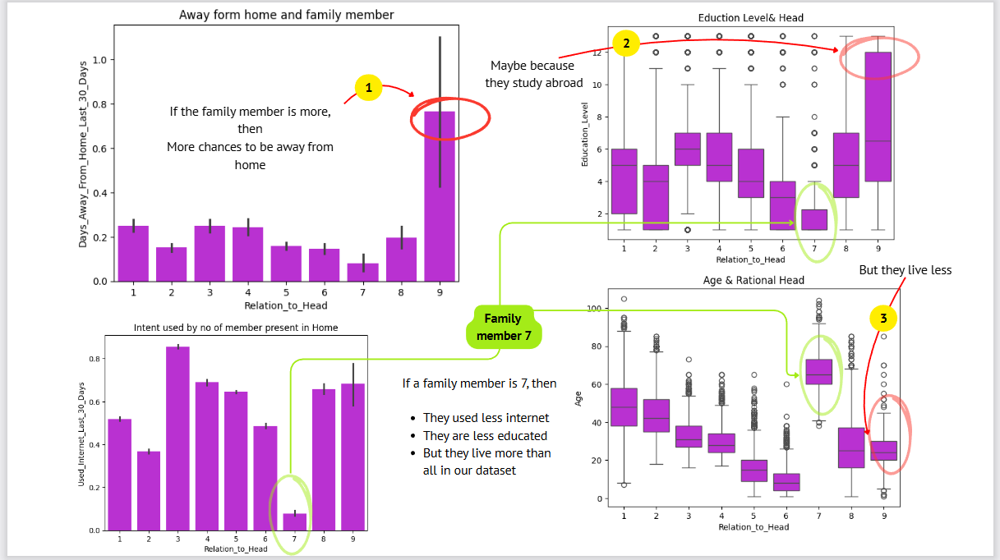
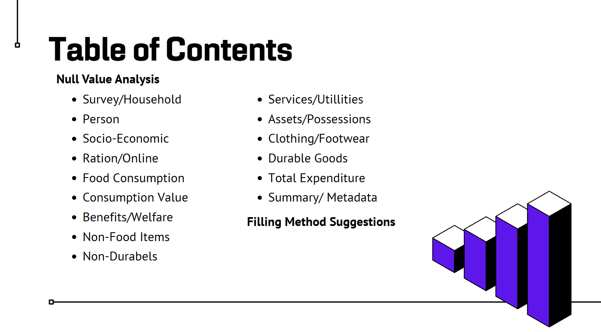
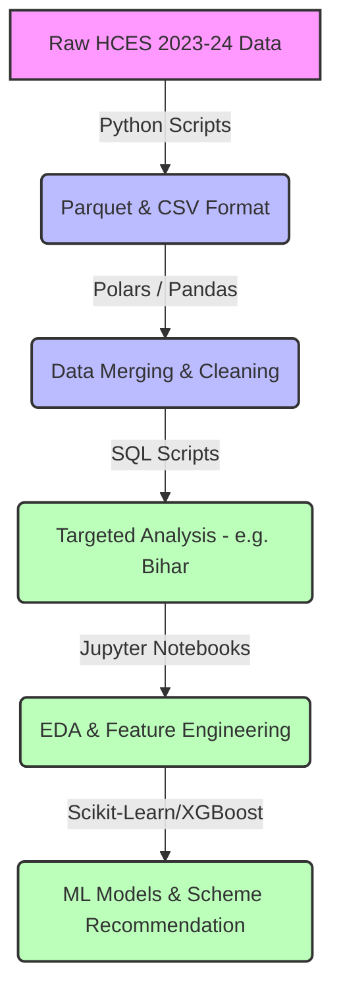
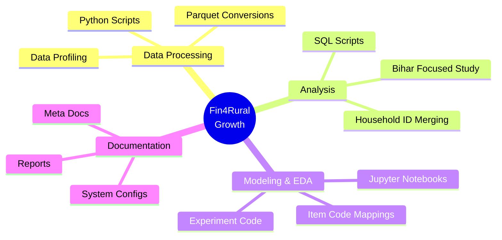
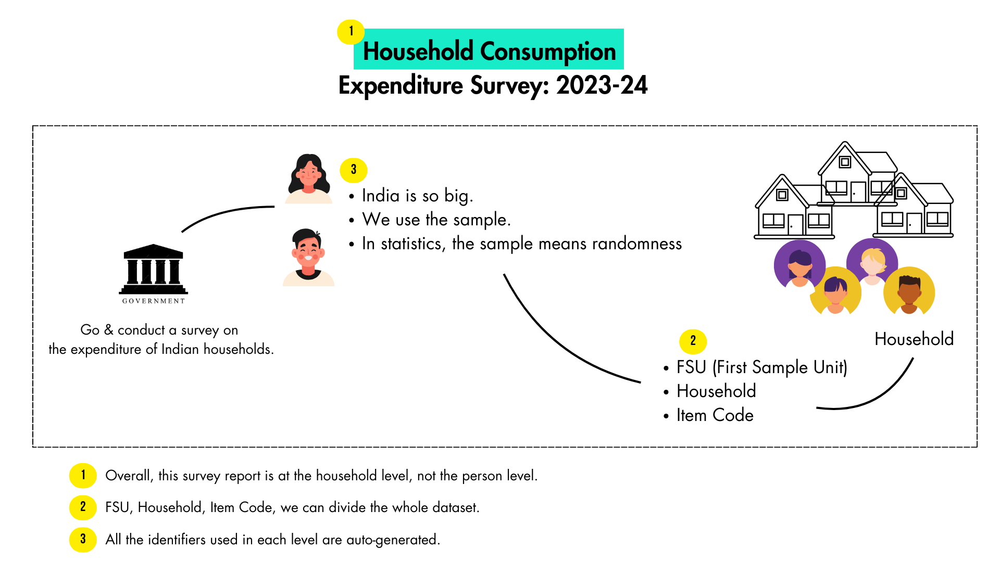

# 🧑‍🌾🪙 Fin4Rural Growth (Rural Financial Inclusion & Govt Scheme Recommendation)


> [!NOTE]
> **HCES Data Story [Report](reports/HCES-DATA-STORY.pdf)**
> Check out `reports/` folder for more reports


---

## 📖 Overview
**Fin4Rural Growth** is a data-driven project aimed at analyzing the **Household Consumption Expenditure Survey (HCES) 2023-24** to understand rural financial dynamics, consumption patterns, and ultimately recommend suitable government schemes to rural households. By leveraging advanced data processing, SQL-based transformations, and Machine Learning models, this project seeks to enhance financial inclusion and empowerment in rural areas.

---

## 🎥 Video Highlights

| HCES Data Story | Find My Joint | Data Quality Issues |
| :---: | :---: | :---: |
| [](https://www.youtube.com/watch?v=SO-5M_YZ_kg&list=PLbYkMkFiXhYYHtjofXEIewTm_gmEyY1d6&index=2) | [](https://www.youtube.com/watch?v=TlMWL8CpebY&list=PLbYkMkFiXhYYHtjofXEIewTm_gmEyY1d6&index=3) | [](https://www.youtube.com/watch?v=OcsfaVl5mhA&list=PLbYkMkFiXhYYHtjofXEIewTm_gmEyY1d6&index=5) |
| How data looks like | Apply my own python libaray on 15 datasets. | Problem I found first glance |

---

## 🛠️ How to Merge Datasets (Step-by-Step)

| Step 1 | Step 2 | Step 3 |
| :---: | :---: | :---: |
|  |  |  |

> **How to merge HCES Data [Report](reports/how-to-merge-solution.pdf)**

---

## 🔍 Deep Analysis

| Category Analysis | Data Quality Check | L02 Analysis | Table of Content |
| :---: | :---: | :---: | :---: |
|  |  |  |  |

---

## 📊 Data Pipeline & Workflow



---


## 📂 Project Structure Overview



---


- **`script/`**: Python scripts for data extraction, fast parquet conversion (`convert-to-parquet.py`), dataset merging via Polars, and auto-visualization profiling.
- **`sql-scripts/`**: Contains robust SQL queries for merging multi-level datasets (e.g., household unique ID creation, specific focus and deep-dives on Bihar state data).
- **`notebooks/`**: Jupyter Notebooks for exploratory data analysis (EDA), correlation testing across levels, and dataset merging operations.
- **`meta/`**: Contains useful external links, dataset metadata, and system configuration specifics (`rudra-system.md`).
- **`item-code/`**: Detailed mapping documents (CSQ, DGQ, FDQ) tying survey question codes to meaningful categories.
- **`reports/`**: Important analytical reports and visual insights, such as the HCES Data Story.

---



---

## 🗄️ Data Sources

The primary data source is the **Household Consumption Expenditure Survey (HCES) 2023-24** from the National Sample Survey (NSS), MoSPI, Government of India.
- **Reference ID:** `DDI-IND-MOSPI-NSS-HCES23-24`
- [Govt of India Microdata Portal](https://microdata.gov.in/NADA/index.php/home)
- [HCES 2023-24 Fact Sheet](https://www.mospi.gov.in/sites/default/files/publication_reports/HCES%20FactSheet%202023-24.pdf)
- [HCES 2023-24 Final Report](https://www.mospi.gov.in/sites/default/files/publication_reports/Final_Report_HCES_2023-24L.pdf)

---

## 🛠️ Technology Stack
- **Languages:** Python 3.10+, SQL
- **Data Manipulation:** `pandas`, `polars`, `numpy`, `Polars`, `PySpark`
- **Machine Learning:** `scikit-learn`, `XGBoost`, `LightGBM`, `CatBoost`
- **Visualization:** `matplotlib`, `plotly`, `folium` (geospatial plotting)
- **Data Storage & File Formats:** `.parquet`, `.csv`, `.dta`, `.ipynb`


---

## 🚀 Getting Started

1. **Clone the repository:**
   ```bash
   git clone https://github.com/Rudra-G-23/rural-financial-inclusion-govt-scheme-recommendation
   cd rural-financial-inclusion-govt-scheme-recommendation
   ```

2. **Install Dependencies:** (Ensure Python 3.10+ is installed)
   ```bash
   pip install pandas polars numpy scikit-learn xgboost matplotlib plotly
   ```

3. **Data Preparation:**
   Use the utility scripts in the `script/` folder to convert `.dta` or raw data into `.parquet` format for highly efficient, low-memory processing.
   ```bash
   python script/convert-to-parquet.py
   ```

4. **Database Setup (Optional but recommended):**
   Execute the scripts in `sql-scripts/bihar/experiment-merge/` to create unique Household IDs and merged database views for deep-dive analysis.

5. **Explore Notebooks:**
   Dive into the `notebooks/` directory to run EDA, view the feature correlations, and explore the ML modeling pipeline.


---

## 🤝 Contribution
Contributions to improve data processing pipelines, feature engineering, or scheme recommendation models are welcome. Please use feature branches and submit PRs for review.
