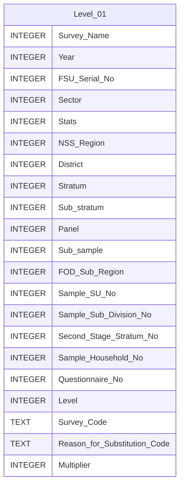

# Level 01

## 🆔 Raw Database Diagram

```mermaid
erDiagram
Level_01 {
    INTEGER Survey_Name
    INTEGER Year
    INTEGER FSU_Serial_No
    INTEGER Sector
    INTEGER Stats
    INTEGER NSS_Region
    INTEGER District
    INTEGER Stratum
    INTEGER Sub_stratum
    INTEGER Panel
    INTEGER Sub_sample
    INTEGER FOD_Sub_Region
    INTEGER Sample_SU_No
    INTEGER Sample_Sub_Division_No
    INTEGER Second_Stage_Stratum_No
    INTEGER Sample_Household_No
    INTEGER Questionnaire_No
    INTEGER Level
    TEXT Survey_Code
    TEXT Reason_for_Substitution_Code
    INTEGER Multiplier
}
```