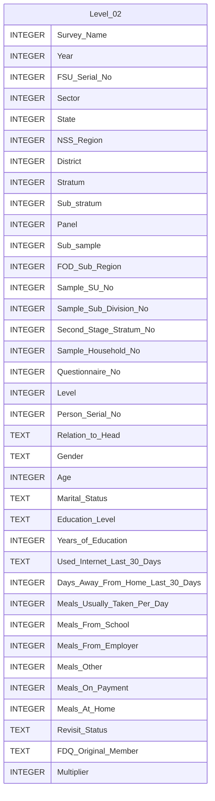

# Level 02

## 🆔 Raw Database Diagram

```mermaid
erDiagram
	Level_02 {
		INTEGER Survey_Name
		INTEGER Year
		INTEGER FSU_Serial_No
		INTEGER Sector
		INTEGER State
		INTEGER NSS_Region
		INTEGER District
		INTEGER Stratum
		INTEGER Sub_stratum
		INTEGER Panel
		INTEGER Sub_sample
		INTEGER FOD_Sub_Region
		INTEGER Sample_SU_No
		INTEGER Sample_Sub_Division_No
		INTEGER Second_Stage_Stratum_No
		INTEGER Sample_Household_No
		INTEGER Questionnaire_No
		INTEGER Level
		INTEGER Person_Serial_No
		TEXT Relation_to_Head
		TEXT Gender
		INTEGER Age
		TEXT Marital_Status
		TEXT Education_Level
		INTEGER Years_of_Education
		TEXT Used_Internet_Last_30_Days
		INTEGER Days_Away_From_Home_Last_30_Days
		INTEGER Meals_Usually_Taken_Per_Day
		INTEGER Meals_From_School
		INTEGER Meals_From_Employer
		INTEGER Meals_Other
		INTEGER Meals_On_Payment
		INTEGER Meals_At_Home
		TEXT Revisit_Status
		TEXT FDQ_Original_Member
		INTEGER Multiplier
	}
```