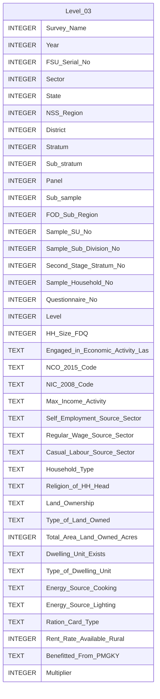

# Level 03

## 🆔 Raw Database Diagram

```mermaid
erDiagram
	Level_03 {
		INTEGER Survey_Name
		INTEGER Year
		INTEGER FSU_Serial_No
		INTEGER Sector
		INTEGER State
		INTEGER NSS_Region
		INTEGER District
		INTEGER Stratum
		INTEGER Sub_stratum
		INTEGER Panel
		INTEGER Sub_sample
		INTEGER FOD_Sub_Region
		INTEGER Sample_SU_No
		INTEGER Sample_Sub_Division_No
		INTEGER Second_Stage_Stratum_No
		INTEGER Sample_Household_No
		INTEGER Questionnaire_No
		INTEGER Level
		INTEGER HH_Size_FDQ
		TEXT Engaged_in_Economic_Activity_Las
		TEXT NCO_2015_Code
		TEXT NIC_2008_Code
		TEXT Max_Income_Activity
		TEXT Self_Employment_Source_Sector
		TEXT Regular_Wage_Source_Sector
		TEXT Casual_Labour_Source_Sector
		TEXT Household_Type
		TEXT Religion_of_HH_Head
		TEXT Land_Ownership
		TEXT Type_of_Land_Owned
		INTEGER Total_Area_Land_Owned_Acres
		TEXT Dwelling_Unit_Exists
		TEXT Type_of_Dwelling_Unit
		TEXT Energy_Source_Cooking
		TEXT Energy_Source_Lighting
		TEXT Ration_Card_Type
		INTEGER Rent_Rate_Available_Rural
		TEXT Benefitted_From_PMGKY
		INTEGER Multiplier
	}
```