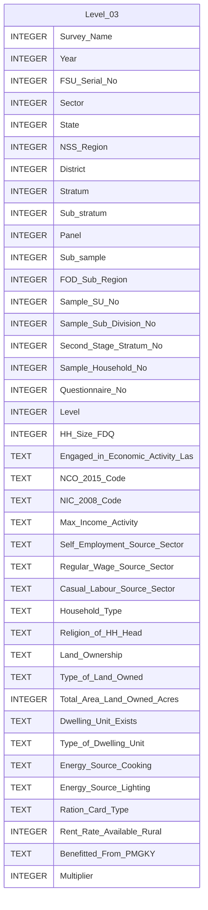

# Level 03 Diagram documentation
## Summary

- [Level 03 Diagram documentation](#level-03-diagram-documentation)
	- [Summary](#summary)
	- [Introduction](#introduction)
	- [Database type](#database-type)
	- [Table structure](#table-structure)
		- [Level 03](#level-03)
	- [Relationships](#relationships)
	- [Database Diagram](#database-diagram)

## Introduction

## Database type

- **Database system:** PostgreSQL
## Table structure

### Level 03

| Name        | Type          | Settings                      | References                    | Note                           |
|-------------|---------------|-------------------------------|-------------------------------|--------------------------------|
| **Survey_Name** | INTEGER | 🔑 PK, not null, unique |  | |
| **Year** | INTEGER | null |  | |
| **FSU_Serial_No** | INTEGER | null |  | |
| **Sector** | INTEGER | null |  | |
| **State** | INTEGER | null |  | |
| **NSS_Region** | INTEGER | null |  | |
| **District** | INTEGER | null |  | |
| **Stratum** | INTEGER | null |  | |
| **Sub_stratum** | INTEGER | null |  | |
| **Panel** | INTEGER | null |  | |
| **Sub_sample** | INTEGER | null |  | |
| **FOD_Sub_Region** | INTEGER | null |  | |
| **Sample_SU_No** | INTEGER | null |  | |
| **Sample_Sub_Division_No** | INTEGER | null |  | |
| **Second_Stage_Stratum_No** | INTEGER | null |  | |
| **Sample_Household_No** | INTEGER | null |  | |
| **Questionnaire_No** | INTEGER | null |  | |
| **Level** | INTEGER | null |  | |
| **HH_Size_FDQ** | INTEGER | null |  | |
| **Engaged_in_Economic_Activity_Las** | TEXT | null |  | |
| **NCO_2015_Code** | TEXT | null |  | |
| **NIC_2008_Code** | TEXT | null |  | |
| **Max_Income_Activity** | TEXT | null |  | |
| **Self_Employment_Source_Sector** | TEXT | null |  | |
| **Regular_Wage_Source_Sector** | TEXT | null |  | |
| **Casual_Labour_Source_Sector** | TEXT | null |  | |
| **Household_Type** | TEXT | null |  | |
| **Religion_of_HH_Head** | TEXT | null |  | |
| **Land_Ownership** | TEXT | null |  | |
| **Type_of_Land_Owned** | TEXT | null |  | |
| **Total_Area_Land_Owned_Acres** | INTEGER | null |  | |
| **Dwelling_Unit_Exists** | TEXT | null |  | |
| **Type_of_Dwelling_Unit** | TEXT | null |  | |
| **Energy_Source_Cooking** | TEXT | null |  | |
| **Energy_Source_Lighting** | TEXT | null |  | |
| **Ration_Card_Type** | TEXT | null |  | |
| **Rent_Rate_Available_Rural** | INTEGER | null |  | |
| **Benefitted_From_PMGKY** | TEXT | null |  | |
| **Multiplier** | INTEGER | null |  | | 

## Relationships

## Database Diagram

