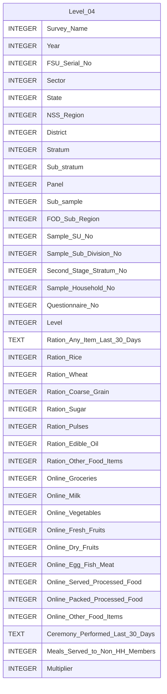

# Level 04

##  🆔 Raw Database Diagram

```mermaid
erDiagram
	Level_04 {
		INTEGER Survey_Name
		INTEGER Year
		INTEGER FSU_Serial_No
		INTEGER Sector
		INTEGER State
		INTEGER NSS_Region
		INTEGER District
		INTEGER Stratum
		INTEGER Sub_stratum
		INTEGER Panel
		INTEGER Sub_sample
		INTEGER FOD_Sub_Region
		INTEGER Sample_SU_No
		INTEGER Sample_Sub_Division_No
		INTEGER Second_Stage_Stratum_No
		INTEGER Sample_Household_No
		INTEGER Questionnaire_No
		INTEGER Level
		TEXT Ration_Any_Item_Last_30_Days
		INTEGER Ration_Rice
		INTEGER Ration_Wheat
		INTEGER Ration_Coarse_Grain
		INTEGER Ration_Sugar
		INTEGER Ration_Pulses
		INTEGER Ration_Edible_Oil
		INTEGER Ration_Other_Food_Items
		INTEGER Online_Groceries
		INTEGER Online_Milk
		INTEGER Online_Vegetables
		INTEGER Online_Fresh_Fruits
		INTEGER Online_Dry_Fruits
		INTEGER Online_Egg_Fish_Meat
		INTEGER Online_Served_Processed_Food
		INTEGER Online_Packed_Processed_Food
		INTEGER Online_Other_Food_Items
		TEXT Ceremony_Performed_Last_30_Days
		INTEGER Meals_Served_to_Non_HH_Members
		INTEGER Multiplier
	}
```