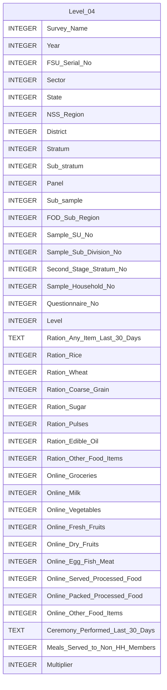

# Level 04 Diagram documentation

## Summary

- [Level 04 Diagram documentation](#level-04-diagram-documentation)
	- [Summary](#summary)
	- [Introduction](#introduction)
	- [Database type](#database-type)
	- [Table structure](#table-structure)
		- [Level 04](#level-04)
	- [Relationships](#relationships)
	- [Database Diagram](#database-diagram)

## Introduction

## Database type

- **Database system:** PostgreSQL
## Table structure

### Level 04

| Name        | Type          | Settings                      | References                    | Note                           |
|-------------|---------------|-------------------------------|-------------------------------|--------------------------------|
| **Survey_Name** | INTEGER | 🔑 PK, not null, unique |  | |
| **Year** | INTEGER | null |  | |
| **FSU_Serial_No** | INTEGER | null |  | |
| **Sector** | INTEGER | null |  | |
| **State** | INTEGER | null |  | |
| **NSS_Region** | INTEGER | null |  | |
| **District** | INTEGER | null |  | |
| **Stratum** | INTEGER | null |  | |
| **Sub_stratum** | INTEGER | null |  | |
| **Panel** | INTEGER | null |  | |
| **Sub_sample** | INTEGER | null |  | |
| **FOD_Sub_Region** | INTEGER | null |  | |
| **Sample_SU_No** | INTEGER | null |  | |
| **Sample_Sub_Division_No** | INTEGER | null |  | |
| **Second_Stage_Stratum_No** | INTEGER | null |  | |
| **Sample_Household_No** | INTEGER | null |  | |
| **Questionnaire_No** | INTEGER | null |  | |
| **Level** | INTEGER | null |  | |
| **Ration_Any_Item_Last_30_Days** | TEXT | null |  | |
| **Ration_Rice** | INTEGER | null |  | |
| **Ration_Wheat** | INTEGER | null |  | |
| **Ration_Coarse_Grain** | INTEGER | null |  | |
| **Ration_Sugar** | INTEGER | null |  | |
| **Ration_Pulses** | INTEGER | null |  | |
| **Ration_Edible_Oil** | INTEGER | null |  | |
| **Ration_Other_Food_Items** | INTEGER | null |  | |
| **Online_Groceries** | INTEGER | null |  | |
| **Online_Milk** | INTEGER | null |  | |
| **Online_Vegetables** | INTEGER | null |  | |
| **Online_Fresh_Fruits** | INTEGER | null |  | |
| **Online_Dry_Fruits** | INTEGER | null |  | |
| **Online_Egg_Fish_Meat** | INTEGER | null |  | |
| **Online_Served_Processed_Food** | INTEGER | null |  | |
| **Online_Packed_Processed_Food** | INTEGER | null |  | |
| **Online_Other_Food_Items** | INTEGER | null |  | |
| **Ceremony_Performed_Last_30_Days** | TEXT | null |  | |
| **Meals_Served_to_Non_HH_Members** | INTEGER | null |  | |
| **Multiplier** | INTEGER | null |  | | 

## Relationships

## Database Diagram

