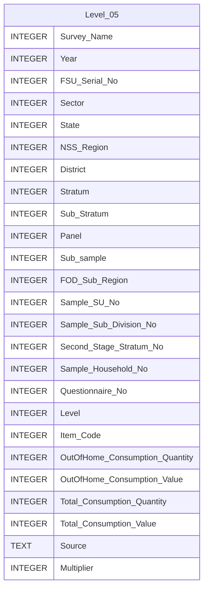

# Level 05

## 🆔 Raw Database Diagram

```mermaid
erDiagram
	Level_05 {
		INTEGER Survey_Name
		INTEGER Year
		INTEGER FSU_Serial_No
		INTEGER Sector
		INTEGER State
		INTEGER NSS_Region
		INTEGER District
		INTEGER Stratum
		INTEGER Sub_Stratum
		INTEGER Panel
		INTEGER Sub_sample
		INTEGER FOD_Sub_Region
		INTEGER Sample_SU_No
		INTEGER Sample_Sub_Division_No
		INTEGER Second_Stage_Stratum_No
		INTEGER Sample_Household_No
		INTEGER Questionnaire_No
		INTEGER Level
		INTEGER Item_Code
		INTEGER OutOfHome_Consumption_Quantity
		INTEGER OutOfHome_Consumption_Value
		INTEGER Total_Consumption_Quantity
		INTEGER Total_Consumption_Value
		TEXT Source
		INTEGER Multiplier
	}
```