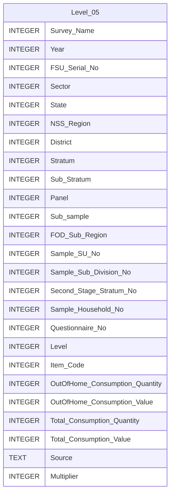

# Level 05 Diagram documentation

## Summary

- [Level 05 Diagram documentation](#level-05-diagram-documentation)
	- [Summary](#summary)
	- [Introduction](#introduction)
	- [Database type](#database-type)
	- [Table structure](#table-structure)
		- [Level\_05](#level_05)
	- [Relationships](#relationships)
	- [Database Diagram](#database-diagram)

## Introduction

## Database type

- **Database system:** PostgreSQL
## Table structure

### Level_05

| Name        | Type          | Settings                      | References                    | Note                           |
|-------------|---------------|-------------------------------|-------------------------------|--------------------------------|
| **Survey_Name** | INTEGER | 🔑 PK, not null, unique |  | |
| **Year** | INTEGER | null |  | |
| **FSU_Serial_No** | INTEGER | null |  | |
| **Sector** | INTEGER | null |  | |
| **State** | INTEGER | null |  | |
| **NSS_Region** | INTEGER | null |  | |
| **District** | INTEGER | null |  | |
| **Stratum** | INTEGER | null |  | |
| **Sub_Stratum** | INTEGER | null |  | |
| **Panel** | INTEGER | null |  | |
| **Sub_sample** | INTEGER | null |  | |
| **FOD_Sub_Region** | INTEGER | null |  | |
| **Sample_SU_No** | INTEGER | null |  | |
| **Sample_Sub_Division_No** | INTEGER | null |  | |
| **Second_Stage_Stratum_No** | INTEGER | null |  | |
| **Sample_Household_No** | INTEGER | null |  | |
| **Questionnaire_No** | INTEGER | null |  | |
| **Level** | INTEGER | null |  | |
| **Item_Code** | INTEGER | null |  | |
| **OutOfHome_Consumption_Quantity** | INTEGER | null |  | |
| **OutOfHome_Consumption_Value** | INTEGER | null |  | |
| **Total_Consumption_Quantity** | INTEGER | null |  | |
| **Total_Consumption_Value** | INTEGER | null |  | |
| **Source** | TEXT | null |  | |
| **Multiplier** | INTEGER | null |  | | 

## Relationships

## Database Diagram

