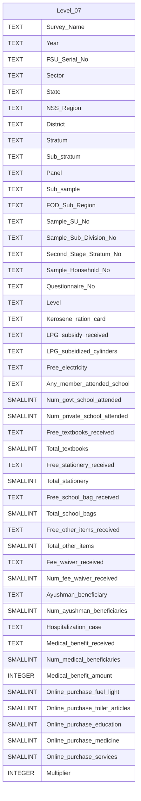

# Level 07

## Database Diagram

```mermaid
erDiagram
	Level_07 {
		TEXT Survey_Name
		TEXT Year
		TEXT FSU_Serial_No
		TEXT Sector
		TEXT State
		TEXT NSS_Region
		TEXT District
		TEXT Stratum
		TEXT Sub_stratum
		TEXT Panel
		TEXT Sub_sample
		TEXT FOD_Sub_Region
		TEXT Sample_SU_No
		TEXT Sample_Sub_Division_No
		TEXT Second_Stage_Stratum_No
		TEXT Sample_Household_No
		TEXT Questionnaire_No
		TEXT Level
		TEXT Kerosene_ration_card
		TEXT LPG_subsidy_received
		TEXT LPG_subsidized_cylinders
		TEXT Free_electricity
		TEXT Any_member_attended_school
		SMALLINT Num_govt_school_attended
		SMALLINT Num_private_school_attended
		TEXT Free_textbooks_received
		SMALLINT Total_textbooks
		TEXT Free_stationery_received
		SMALLINT Total_stationery
		TEXT Free_school_bag_received
		SMALLINT Total_school_bags
		TEXT Free_other_items_received
		SMALLINT Total_other_items
		TEXT Fee_waiver_received
		SMALLINT Num_fee_waiver_received
		TEXT Ayushman_beneficiary
		SMALLINT Num_ayushman_beneficiaries
		TEXT Hospitalization_case
		TEXT Medical_benefit_received
		SMALLINT Num_medical_beneficiaries
		INTEGER Medical_benefit_amount
		SMALLINT Online_purchase_fuel_light
		SMALLINT Online_purchase_toilet_articles
		SMALLINT Online_purchase_education
		SMALLINT Online_purchase_medicine
		SMALLINT Online_purchase_services
		INTEGER Multiplier
	}
```