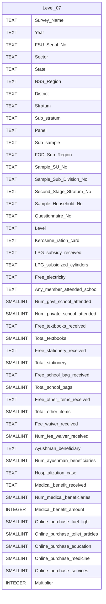

# Level 07 Diagram documentation
## Summary

- [Level 07 Diagram documentation](#level-07-diagram-documentation)
	- [Summary](#summary)
	- [Introduction](#introduction)
	- [Database type](#database-type)
	- [Table structure](#table-structure)
		- [Level\_07](#level_07)
	- [Relationships](#relationships)
	- [Database Diagram](#database-diagram)

## Introduction

## Database type

- **Database system:** PostgreSQL
## Table structure

### Level_07

| Name        | Type          | Settings                      | References                    | Note                           |
|-------------|---------------|-------------------------------|-------------------------------|--------------------------------|
| **Survey_Name** | TEXT | 🔑 PK, null |  | |
| **Year** | TEXT | null |  | |
| **FSU_Serial_No** | TEXT | null |  | |
| **Sector** | TEXT | null |  | |
| **State** | TEXT | null |  | |
| **NSS_Region** | TEXT | null |  | |
| **District** | TEXT | null |  | |
| **Stratum** | TEXT | null |  | |
| **Sub_stratum** | TEXT | null |  | |
| **Panel** | TEXT | null |  | |
| **Sub_sample** | TEXT | null |  | |
| **FOD_Sub_Region** | TEXT | null |  | |
| **Sample_SU_No** | TEXT | null |  | |
| **Sample_Sub_Division_No** | TEXT | null |  | |
| **Second_Stage_Stratum_No** | TEXT | null |  | |
| **Sample_Household_No** | TEXT | null |  | |
| **Questionnaire_No** | TEXT | null |  | |
| **Level** | TEXT | null |  | |
| **Kerosene_ration_card** | TEXT | null |  | |
| **LPG_subsidy_received** | TEXT | null |  | |
| **LPG_subsidized_cylinders** | TEXT | null |  | |
| **Free_electricity** | TEXT | null |  | |
| **Any_member_attended_school** | TEXT | null |  | |
| **Num_govt_school_attended** | SMALLINT | null |  | |
| **Num_private_school_attended** | SMALLINT | null |  | |
| **Free_textbooks_received** | TEXT | null |  | |
| **Total_textbooks** | SMALLINT | null |  | |
| **Free_stationery_received** | TEXT | null |  | |
| **Total_stationery** | SMALLINT | null |  | |
| **Free_school_bag_received** | TEXT | null |  | |
| **Total_school_bags** | SMALLINT | null |  | |
| **Free_other_items_received** | TEXT | null |  | |
| **Total_other_items** | SMALLINT | null |  | |
| **Fee_waiver_received** | TEXT | null |  | |
| **Num_fee_waiver_received** | SMALLINT | null |  | |
| **Ayushman_beneficiary** | TEXT | null |  | |
| **Num_ayushman_beneficiaries** | SMALLINT | null |  | |
| **Hospitalization_case** | TEXT | null |  | |
| **Medical_benefit_received** | TEXT | null |  | |
| **Num_medical_beneficiaries** | SMALLINT | null |  | |
| **Medical_benefit_amount** | INTEGER | null |  | |
| **Online_purchase_fuel_light** | SMALLINT | null |  | |
| **Online_purchase_toilet_articles** | SMALLINT | null |  | |
| **Online_purchase_education** | SMALLINT | null |  | |
| **Online_purchase_medicine** | SMALLINT | null |  | |
| **Online_purchase_services** | SMALLINT | null |  | |
| **Multiplier** | INTEGER | null |  | | 

## Relationships

## Database Diagram

