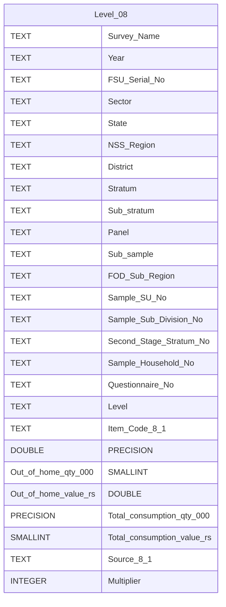

# Level 08

## Database Diagram

```mermaid
erDiagram
	Level_08 {
		TEXT Survey_Name
		TEXT Year
		TEXT FSU_Serial_No
		TEXT Sector
		TEXT State
		TEXT NSS_Region
		TEXT District
		TEXT Stratum
		TEXT Sub_stratum
		TEXT Panel
		TEXT Sub_sample
		TEXT FOD_Sub_Region
		TEXT Sample_SU_No
		TEXT Sample_Sub_Division_No
		TEXT Second_Stage_Stratum_No
		TEXT Sample_Household_No
		TEXT Questionnaire_No
		TEXT Level
		TEXT Item_Code_8_1
		DOUBLE PRECISION Out_of_home_qty_000
		SMALLINT Out_of_home_value_rs
		DOUBLE PRECISION Total_consumption_qty_000
		SMALLINT Total_consumption_value_rs
		TEXT Source_8_1
		INTEGER Multiplier
	}
```