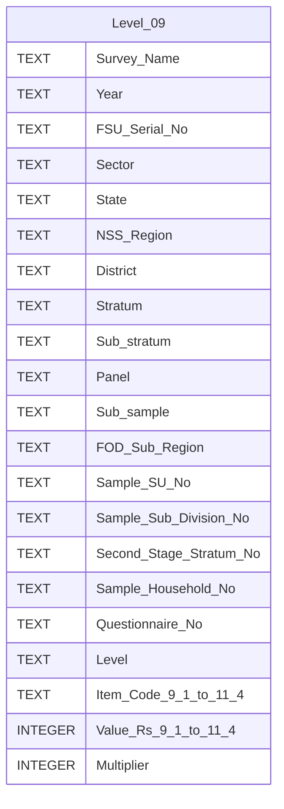

# Level 09 Diagram documentation
## Summary

- [Level 09 Diagram documentation](#level-09-diagram-documentation)
	- [Summary](#summary)
	- [Introduction](#introduction)
	- [Database type](#database-type)
	- [Table structure](#table-structure)
		- [Level\_09](#level_09)
	- [Relationships](#relationships)
	- [Database Diagram](#database-diagram)

## Introduction

## Database type

- **Database system:** PostgreSQL
## Table structure

### Level_09

| Name        | Type          | Settings                      | References                    | Note                           |
|-------------|---------------|-------------------------------|-------------------------------|--------------------------------|
| **Survey_Name** | TEXT | 🔑 PK, null |  | |
| **Year** | TEXT | null |  | |
| **FSU_Serial_No** | TEXT | null |  | |
| **Sector** | TEXT | null |  | |
| **State** | TEXT | null |  | |
| **NSS_Region** | TEXT | null |  | |
| **District** | TEXT | null |  | |
| **Stratum** | TEXT | null |  | |
| **Sub_stratum** | TEXT | null |  | |
| **Panel** | TEXT | null |  | |
| **Sub_sample** | TEXT | null |  | |
| **FOD_Sub_Region** | TEXT | null |  | |
| **Sample_SU_No** | TEXT | null |  | |
| **Sample_Sub_Division_No** | TEXT | null |  | |
| **Second_Stage_Stratum_No** | TEXT | null |  | |
| **Sample_Household_No** | TEXT | null |  | |
| **Questionnaire_No** | TEXT | null |  | |
| **Level** | TEXT | null |  | |
| **Item_Code_9_1_to_11_4** | TEXT | null |  | |
| **Value_Rs_9_1_to_11_4** | INTEGER | null |  | |
| **Multiplier** | INTEGER | null |  | | 

## Relationships

## Database Diagram

