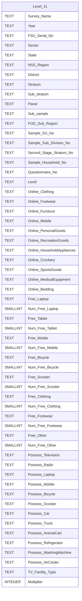

# Level 11

## Database Diagram

```mermaid
erDiagram
	Level_11 {
		TEXT Survey_Name
		TEXT Year
		TEXT FSU_Serial_No
		TEXT Sector
		TEXT State
		TEXT NSS_Region
		TEXT District
		TEXT Stratum
		TEXT Sub_stratum
		TEXT Panel
		TEXT Sub_sample
		TEXT FOD_Sub_Region
		TEXT Sample_SU_No
		TEXT Sample_Sub_Division_No
		TEXT Second_Stage_Stratum_No
		TEXT Sample_Household_No
		TEXT Questionnaire_No
		TEXT Level
		TEXT Online_Clothing
		TEXT Online_Footwear
		TEXT Online_Furniture
		TEXT Online_Mobile
		TEXT Online_PersonalGoods
		TEXT Online_RecreationGoods
		TEXT Online_HouseholdAppliances
		TEXT Online_Crockery
		TEXT Online_SportsGoods
		TEXT Online_MedicalEquipment
		TEXT Online_Bedding
		TEXT Free_Laptop
		SMALLINT Num_Free_Laptop
		TEXT Free_Tablet
		SMALLINT Num_Free_Tablet
		TEXT Free_Mobile
		SMALLINT Num_Free_Mobile
		TEXT Free_Bicycle
		SMALLINT Num_Free_Bicycle
		TEXT Free_Scooter
		SMALLINT Num_Free_Scooter
		TEXT Free_Clothing
		SMALLINT Num_Free_Clothing
		TEXT Free_Footwear
		SMALLINT Num_Free_Footwear
		TEXT Free_Other
		SMALLINT Num_Free_Other
		TEXT Possess_Television
		TEXT Possess_Radio
		TEXT Possess_Laptop
		TEXT Possess_Mobile
		TEXT Possess_Bicycle
		TEXT Possess_Scooter
		TEXT Possess_Car
		TEXT Possess_Truck
		TEXT Possess_AnimalCart
		TEXT Possess_Refrigerator
		TEXT Possess_WashingMachine
		TEXT Possess_AirCooler
		TEXT TV_Facility_Type
		INTEGER Multiplier
	}
```