# Level 11 Diagram documentation
## Summary

- [Level 11 Diagram documentation](#level-11-diagram-documentation)
	- [Summary](#summary)
	- [Introduction](#introduction)
	- [Database type](#database-type)
	- [Table structure](#table-structure)
		- [Level\_11](#level_11)
	- [Relationships](#relationships)
	- [Database Diagram](#database-diagram)

## Introduction

## Database type

- **Database system:** PostgreSQL
## Table structure

### Level_11

| Name        | Type          | Settings                      | References                    | Note                           |
|-------------|---------------|-------------------------------|-------------------------------|--------------------------------|
| **Survey_Name** | TEXT | 🔑 PK, null |  | |
| **Year** | TEXT | null |  | |
| **FSU_Serial_No** | TEXT | null |  | |
| **Sector** | TEXT | null |  | |
| **State** | TEXT | null |  | |
| **NSS_Region** | TEXT | null |  | |
| **District** | TEXT | null |  | |
| **Stratum** | TEXT | null |  | |
| **Sub_stratum** | TEXT | null |  | |
| **Panel** | TEXT | null |  | |
| **Sub_sample** | TEXT | null |  | |
| **FOD_Sub_Region** | TEXT | null |  | |
| **Sample_SU_No** | TEXT | null |  | |
| **Sample_Sub_Division_No** | TEXT | null |  | |
| **Second_Stage_Stratum_No** | TEXT | null |  | |
| **Sample_Household_No** | TEXT | null |  | |
| **Questionnaire_No** | TEXT | null |  | |
| **Level** | TEXT | null |  | |
| **Online_Clothing** | TEXT | null |  | |
| **Online_Footwear** | TEXT | null |  | |
| **Online_Furniture** | TEXT | null |  | |
| **Online_Mobile** | TEXT | null |  | |
| **Online_PersonalGoods** | TEXT | null |  | |
| **Online_RecreationGoods** | TEXT | null |  | |
| **Online_HouseholdAppliances** | TEXT | null |  | |
| **Online_Crockery** | TEXT | null |  | |
| **Online_SportsGoods** | TEXT | null |  | |
| **Online_MedicalEquipment** | TEXT | null |  | |
| **Online_Bedding** | TEXT | null |  | |
| **Free_Laptop** | TEXT | null |  | |
| **Num_Free_Laptop** | SMALLINT | null |  | |
| **Free_Tablet** | TEXT | null |  | |
| **Num_Free_Tablet** | SMALLINT | null |  | |
| **Free_Mobile** | TEXT | null |  | |
| **Num_Free_Mobile** | SMALLINT | null |  | |
| **Free_Bicycle** | TEXT | null |  | |
| **Num_Free_Bicycle** | SMALLINT | null |  | |
| **Free_Scooter** | TEXT | null |  | |
| **Num_Free_Scooter** | SMALLINT | null |  | |
| **Free_Clothing** | TEXT | null |  | |
| **Num_Free_Clothing** | SMALLINT | null |  | |
| **Free_Footwear** | TEXT | null |  | |
| **Num_Free_Footwear** | SMALLINT | null |  | |
| **Free_Other** | TEXT | null |  | |
| **Num_Free_Other** | SMALLINT | null |  | |
| **Possess_Television** | TEXT | null |  | |
| **Possess_Radio** | TEXT | null |  | |
| **Possess_Laptop** | TEXT | null |  | |
| **Possess_Mobile** | TEXT | null |  | |
| **Possess_Bicycle** | TEXT | null |  | |
| **Possess_Scooter** | TEXT | null |  | |
| **Possess_Car** | TEXT | null |  | |
| **Possess_Truck** | TEXT | null |  | |
| **Possess_AnimalCart** | TEXT | null |  | |
| **Possess_Refrigerator** | TEXT | null |  | |
| **Possess_WashingMachine** | TEXT | null |  | |
| **Possess_AirCooler** | TEXT | null |  | |
| **TV_Facility_Type** | TEXT | null |  | |
| **Multiplier** | INTEGER | null |  | | 

## Relationships

## Database Diagram

```mermaid
erDiagram
	Level_11 {
		TEXT Survey_Name
		TEXT Year
		TEXT FSU_Serial_No
		TEXT Sector
		TEXT State
		TEXT NSS_Region
		TEXT District
		TEXT Stratum
		TEXT Sub_stratum
		TEXT Panel
		TEXT Sub_sample
		TEXT FOD_Sub_Region
		TEXT Sample_SU_No
		TEXT Sample_Sub_Division_No
		TEXT Second_Stage_Stratum_No
		TEXT Sample_Household_No
		TEXT Questionnaire_No
		TEXT Level
		TEXT Online_Clothing
		TEXT Online_Footwear
		TEXT Online_Furniture
		TEXT Online_Mobile
		TEXT Online_PersonalGoods
		TEXT Online_RecreationGoods
		TEXT Online_HouseholdAppliances
		TEXT Online_Crockery
		TEXT Online_SportsGoods
		TEXT Online_MedicalEquipment
		TEXT Online_Bedding
		TEXT Free_Laptop
		SMALLINT Num_Free_Laptop
		TEXT Free_Tablet
		SMALLINT Num_Free_Tablet
		TEXT Free_Mobile
		SMALLINT Num_Free_Mobile
		TEXT Free_Bicycle
		SMALLINT Num_Free_Bicycle
		TEXT Free_Scooter
		SMALLINT Num_Free_Scooter
		TEXT Free_Clothing
		SMALLINT Num_Free_Clothing
		TEXT Free_Footwear
		SMALLINT Num_Free_Footwear
		TEXT Free_Other
		SMALLINT Num_Free_Other
		TEXT Possess_Television
		TEXT Possess_Radio
		TEXT Possess_Laptop
		TEXT Possess_Mobile
		TEXT Possess_Bicycle
		TEXT Possess_Scooter
		TEXT Possess_Car
		TEXT Possess_Truck
		TEXT Possess_AnimalCart
		TEXT Possess_Refrigerator
		TEXT Possess_WashingMachine
		TEXT Possess_AirCooler
		TEXT TV_Facility_Type
		INTEGER Multiplier
	}
```

