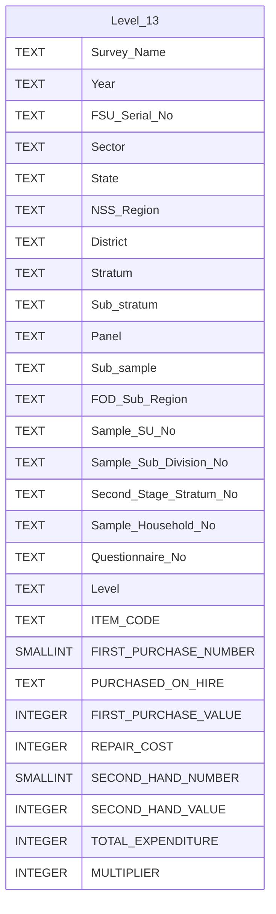

# Level 13

## Database Diagram

```mermaid
erDiagram
	Level_13 {
		TEXT Survey_Name
		TEXT Year
		TEXT FSU_Serial_No
		TEXT Sector
		TEXT State
		TEXT NSS_Region
		TEXT District
		TEXT Stratum
		TEXT Sub_stratum
		TEXT Panel
		TEXT Sub_sample
		TEXT FOD_Sub_Region
		TEXT Sample_SU_No
		TEXT Sample_Sub_Division_No
		TEXT Second_Stage_Stratum_No
		TEXT Sample_Household_No
		TEXT Questionnaire_No
		TEXT Level
		TEXT ITEM_CODE
		SMALLINT FIRST_PURCHASE_NUMBER
		TEXT PURCHASED_ON_HIRE
		INTEGER FIRST_PURCHASE_VALUE
		INTEGER REPAIR_COST
		SMALLINT SECOND_HAND_NUMBER
		INTEGER SECOND_HAND_VALUE
		INTEGER TOTAL_EXPENDITURE
		INTEGER MULTIPLIER
	}
```