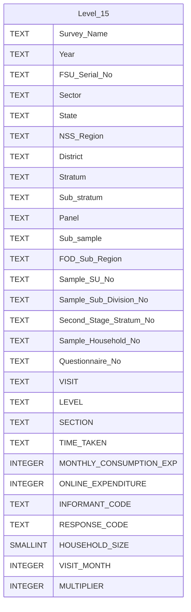

# Level 15

## Database Diagram

```mermaid
erDiagram
	Level_15 {
		TEXT Survey_Name
		TEXT Year
		TEXT FSU_Serial_No
		TEXT Sector
		TEXT State
		TEXT NSS_Region
		TEXT District
		TEXT Stratum
		TEXT Sub_stratum
		TEXT Panel
		TEXT Sub_sample
		TEXT FOD_Sub_Region
		TEXT Sample_SU_No
		TEXT Sample_Sub_Division_No
		TEXT Second_Stage_Stratum_No
		TEXT Sample_Household_No
		TEXT Questionnaire_No
		TEXT VISIT
		TEXT LEVEL
		TEXT SECTION
		TEXT TIME_TAKEN
		INTEGER MONTHLY_CONSUMPTION_EXP
		INTEGER ONLINE_EXPENDITURE
		TEXT INFORMANT_CODE
		TEXT RESPONSE_CODE
		SMALLINT HOUSEHOLD_SIZE
		INTEGER VISIT_MONTH
		INTEGER MULTIPLIER
	}
```